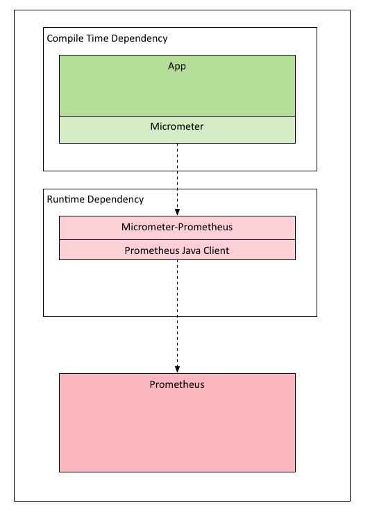

&copy; Copyright (c) 2021, Ritesh. All rights reserved.
# Micrometer
#### What design pattern does micrometer follows?
It follows Facade design pattern. Facade pattern hides the complexities of the system and provides an interface to the client using which the client can access the system. 
Reference: https://www.tutorialspoint.com/design_pattern/facade_pattern.htm
#### Architecture Diagram/Design Pattern:

# Prometheus Setup 
Prometheus services with docker/docker-compose:
##### Bind-mount the directory containing prometheus.yml onto /etc/prometheus by running::
    docker run --name my-prometheus -d \
        -p 9090:9090 \
        -v /Users/riteshbangal/Geeks/workshop/prometheus/config:/etc/prometheus \
        prom/prometheus
##### Create a Prometheus configuration and a Dockerfile and execute following commands:
    docker build -t my-prometheus .
    docker run -p 9090:9090 my-prometheus

##### Create a Prometheus configuration and a docker-compose.yaml and execute following commands:
    docker-compose up -d
    
Prometheus URL: open http://localhost:9000

You'll see Prometheus UI where you can enter some ad-hoc queries on your metrics, like 'up':
Some Sample metrics: http://localhost:9000/metrics

    http_server_requests_seconds_count{exception="None", method="GET",outcome="SUCCESS",status="200",uri="/actuator/health"}

If you use --web.enable-lifecycle you can reload configuration files (e.g. rules) without restarting Prometheus:
    
    curl -X POST http://localhost:9000/-/reload

> References: 
 *	https://github.com/prometheus/prometheus
 *	https://prometheus.io/docs/introduction/first_steps
 *  https://hub.docker.com/r/prom/prometheus/dockerfile
 *  https://dev.to/ablx/minimal-prometheus-setup-with-docker-compose-56mp
 
 
 
 
 